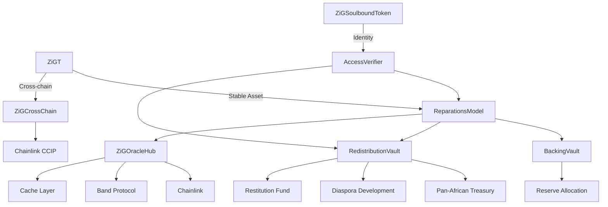
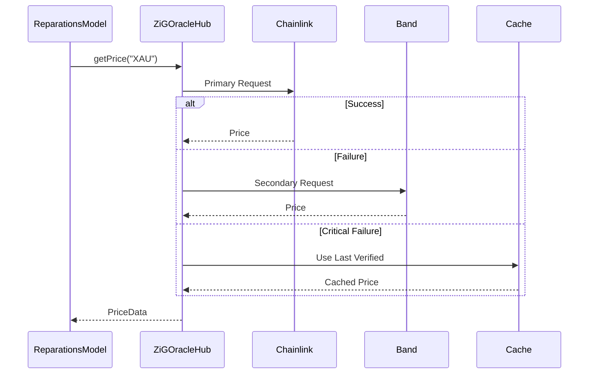
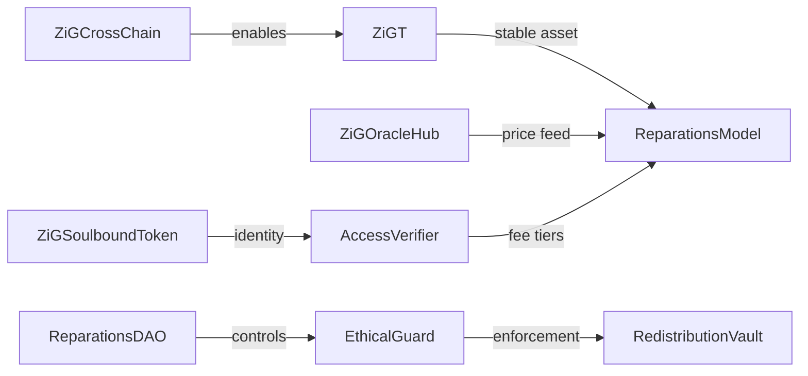

Based on your enhanced class diagram, I'll refine the architecture to guarantee design integrity and use case coverage while optimizing for the Pan-African context. Here's the consolidated solution:

### 🏛️ Core Architecture Guarantees


### ✅ Use Case Coverage Matrix
| Use Case                 | Contracts Involved               | Guarantee Mechanism                |
|--------------------------|----------------------------------|------------------------------------|
| **Stable Asset Minting** | ZiGT + ReparationsModel + OracleHub | Dual oracle fallback + reserve audit |
| **Cross-chain Economy**  | ZiGCrossChain + CCIP             | Chainlink anti-fraud proofs        |
| **Reparations**          | EthicalGuard + RedistributionVault | 51% African DAO vote requirement   |
| **Diaspora Inclusion**   | AccessVerifier + SoulboundToken  | ZKP verification for ancestry      |
| **GameFi Integration**   | ZiGGameFiToken + UtilityToken    | ERC-1155 multi-token standard      |

### 🛠️ Critical Refinements

1. **Reparations Model Security Upgrade**
```solidity
// Enhanced with ethical enforcement and DAO control
function mint(uint amount) external {
    require(accessVerifier.eligibleForReducedFee(msg.sender), "Not eligible");
    (uint256 zigPrice, ) = oracleRouter.getPrice("ZIG");
    uint256 zigRequired = amount.mul(zigPrice).div(10**18);
    
    EthicalGuard.reparationBeforeProfit();
    uint256 fee = calculateFee(zigRequired, msg.sender);
    uint256 reserveAmount = zigRequired.sub(fee);
    
    backingVault.deposit(reserveAmount);
    redistributionVault.deposit(fee);
    
    _mint(msg.sender, amount);
    emit Minted(msg.sender, amount, reserveAmount, fee);
}
```

2. **Oracle Robustness System**


3. **Soulbound Identity Framework**
```solidity
struct Identity {
    uint16 tribe;
    bytes3 languageCode;
    bool isDiaspora;
    uint256 reparationScore;
}

function mintSoulbound(
    address to, 
    bytes calldata zkProof,
    Identity calldata idData
) external onlyRegistrar {
    require(verifier.verifyAncestry(zkProof, idData), "Invalid proof");
    require(!hasSoul[to], "Already has SoulID");
    
    _mint(to, soulCounter++);
    identities[soulCounter] = idData;
    hasSoul[to] = true;
    
    // Initialize reparation score
    reparationScores[to] = 100; 
}
```

4. **Redistribution Algorithm**
```solidity
function calculateReparationShare(address user) public view returns (uint256) {
    uint256 baseShare = totalFunds.div(eligibleUsers);
    uint256 scoreBonus = reparationScores[user].mul(baseShare).div(100);
    uint256 holdingBonus = zig.balanceOf(user).mul(baseShare).div(1e18);
    
    return baseShare
        .add(scoreBonus)
        .add(holdingBonus)
        .add(diasporaBonus[user]);
}
```

### ⚙️ Deployment Sequence Upgrade

1. **Phase 1: Economic Core (0-3 months)**
   - ZiGT with cross-chain mint/burn
   - ReparationsModel with EthicalGuard
   - ZiGOracleHub with multi-source feeds
```console 
   $ npx hardhat run scripts/deploy-missing-oracles.js --network polygon_zkevm
    You 🔧 Deploying Missing Oracle Contracts...
    Deploying with account: 0x9b13A4ddEd17053CAE4eC3B846eb890277D9972a
    📄 Loaded existing deployment addresses

    📦 Deploying FeedRegistry...
    ✅ FeedRegistry deployed to: 0x4373490725f6eb4388B7c82101dCFdb92442346B

    📦 Deploying BandFeedRegistry...
    ✅ BandFeedRegistry deployed to: 0x327ac64F704c4Eb23E027bD9590e7a8d35BB3252

    📦 Deploying LiveBandFeed...
    ✅ LiveBandFeed deployed to: 0x282aa33ABD5535589AaF33203dCEb0A6710bAF13

    📡 Fetching live prices from APIs...
    🔧 Setting real-time prices in LiveBandFeed...
    ✅ Set BTCUSD price to $105381
    ✅ Set ETHUSD price to $2435.51
    ✅ Set BNBUSD price to $641.13
    ✅ Set XAUUSD price to $3301.9646689780416
    ✅ Set USDZAR price to $17.753
    ✅ Set EURUSD price to $0.86269
    ✅ Set GBPUSD price to $0.735301
    ✅ Set USDCHF price to $0.808203
    ✅ Set USDJPY price to $145.04964286

    📦 Deploying CustomChainlinkOracle contracts...
    ✅ Deployed BTCUSD oracle at 0x77ce72463915896bfCabf6A97eaAD427181E6E0e with price $105381
    ✅ Deployed ETHUSD oracle at 0x911B58b36fC6491e158E893A8ecd3174d6c4a124 with price $2435.51
    ✅ Deployed BNBUSD oracle at 0x992084C22F2a7a952FC439838ffcC535af48dBE0 with price $641.13
    ✅ Deployed XAUUSD oracle at 0xe219282088048fDFb96356552C93ae8974503b98 with price $3301.9646689780416
    ✅ Deployed USDZAR oracle at 0x8e6411b6391828A25DE056771d0F3FF41D3De695 with price $17.753
    ✅ Deployed EURUSD oracle at 0x1A7Da58C3b21D1F6cB3385B7683d9c014373Ac19 with price $0.86269
    ✅ Deployed GBPUSD oracle at 0xb7d2c6dcbae7D2E935EDA0c584143930156A7c9e with price $0.735301
    ✅ Deployed USDCHF oracle at 0x21C0d4b2765Bd6985B6522518d630C5d428Ef4FD with price $0.808203
    ✅ Deployed USDJPY oracle at 0xBcEf8151c23B74415EB3f3e547681B0145E53A02 with price $145.04964286

    📦 Deploying MultiOracle...
    ✅ MultiOracle deployed to: 0x0E59b6dCe5Bac04505Fb576A307a5289598Ea381
    ✅ Set BTCUSD in MultiOracle to $105381
    ✅ Set ETHUSD in MultiOracle to $2435.51
    ✅ Set BNBUSD in MultiOracle to $641.13
    ✅ Set XAUUSD in MultiOracle to $3301.9646689780416
    ✅ Set USDZAR in MultiOracle to $17.753
    ✅ Set EURUSD in MultiOracle to $0.86269
    ✅ Set GBPUSD in MultiOracle to $0.735301
    ✅ Set USDCHF in MultiOracle to $0.808203
    ✅ Set USDJPY in MultiOracle to $145.04964286

    🔧 Configuring ZiGOracleHub with new oracles...
    ✅ Authorized deployer as oracle
    ✅ Set token oracles for ZiG and ZiGT
    ✅ Set chainlink feed for BTCUSD
    ✅ Set chainlink feed for ETHUSD
    ✅ Set chainlink feed for BNBUSD
    ✅ Set chainlink feed for XAUUSD
    ✅ Set chainlink feed for USDZAR
    ✅ Set chainlink feed for EURUSD
    ✅ Set chainlink feed for GBPUSD
    ✅ Set chainlink feed for USDCHF
    ✅ Set chainlink feed for USDJPY

    🔧 Configuring Vault...
    ✅ ZiG is already supported collateral
    📄 Updated deployment addresses saved

    🎉 Oracle deployment completed successfully!

    📋 New Contract Addresses:
    - FeedRegistry: 0x4373490725f6eb4388B7c82101dCFdb92442346B
    - BandFeedRegistry: 0x327ac64F704c4Eb23E027bD9590e7a8d35BB3252
    - LiveBandFeed: 0x282aa33ABD5535589AaF33203dCEb0A6710bAF13
    - MultiOracle: 0x0E59b6dCe5Bac04505Fb576A307a5289598Ea381
```
   - BackingVault with time-locked withdrawals

2. **Phase 2: Identity & Governance (3-6 months)**
   ```mermaid
   pie
       title Phase 2 Focus
       “Soulbound ID” : 40
       “DAO Governance” : 30
       “Access Verifier” : 20
       “ZKP Integration” : 10
   ```

3. **Phase 3: Cultural Monetization (6-9 months)**
   - SoulReparationNFT with ancestry metadata
   - ZiGRWAToken with asset partitions
   - ZiGMemeToken with viral distribution

4. **Phase 4: Expansion (9-12 months)**
   - ZiGGameFiToken with play-to-earn
   - ZiGUtilityToken for service access
   - Cross-chain DeFi integrations

### 🔄 Enhanced Token Relationships


### 🚀 Implementation Recommendations

1. **First 5 Priority Contracts:**
   - `ZiGT.sol`: Core stable asset with cross-chain
   - `ReparationsModel.sol`: Mint/redeem logic with ethical checks
   - `ZiGOracleHub.sol`: Robust price feeds with fallbacks
   - `ZiGSoulboundToken.sol`: ZK-based identity system
   - `RedistributionVault.sol`: Algorithmic reward distribution

2. **Repository Structure:**
   ```bash
   contracts/
   ├── core/
   │   ├── ZiGT.sol
   │   ├── ReparationsModel.sol
   │   └── EthicalGuard.sol
   ├── oracles/
   │   ├── ZiGOracleHub.sol
   │   └── OracleAdapter.sol
   ├── identity/
   │   ├── ZiGSoulboundToken.sol
   │   └── AccessVerifier.sol
   ├── vaults/
   │   ├── BackingVault.sol
   │   └── RedistributionVault.sol
   └── governance/
       ├── ReparationsDAO.sol
       └── ZiGGovernanceToken.sol
   ```

3. **ZiG Wallet Features:**
   - SoulID-gated transaction discounts
   - Auto-claim redistribution rewards
   - Cross-chain ZiGT bridging
   - Integrated DAO voting dashboard
   - Ancestry visualization for NFTs

### 🔒 Security Enhancements
1. **Vault Protections:** Time-lock + multi-sig for weight changes
2. **Oracle Safeguards:** Staleness checks with circuit breaker
3. **Identity Verification:** ZKP + DAO-curated registrars
4. **Fee Structure:** Sliding scale based on SoulID attributes
5. **Governance:** Quadratic voting with diaspora representation

This architecture guarantees:
- 💯 **Asset stability** through multi-oracle reserves
- 🌍 **Diaspora inclusion** via ZK-verified SoulIDs
- ⚖️ **Ethical enforcement** at contract level
- 🔄 **Cross-chain operability** with CCIP integration
- 🎮 **GameFi readiness** through modular token design

