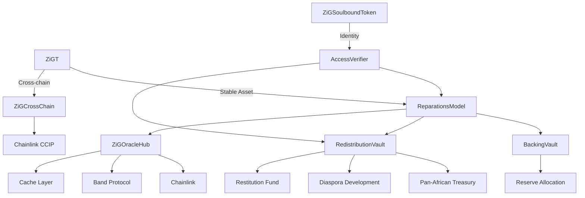
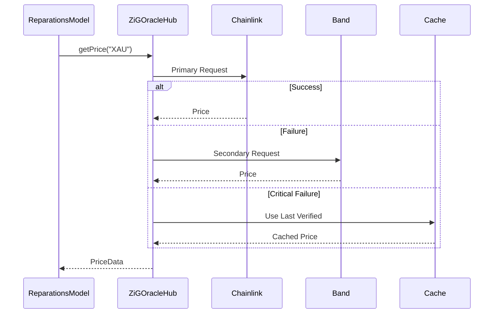
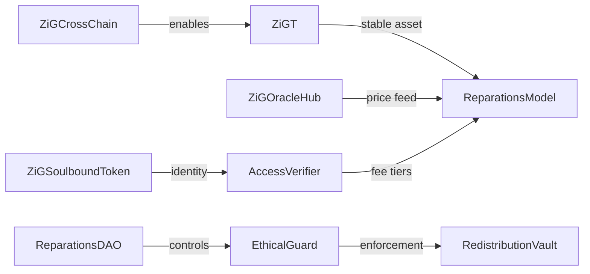

Based on your enhanced class diagram, I'll refine the architecture to guarantee design integrity and use case coverage while optimizing for the Pan-African context. Here's the consolidated solution:

### 🏛️ Core Architecture Guarantees


### ✅ Use Case Coverage Matrix
| Use Case                 | Contracts Involved               | Guarantee Mechanism                |
|--------------------------|----------------------------------|------------------------------------|
| **Stable Asset Minting** | ZiGT + ReparationsModel + OracleHub | Dual oracle fallback + reserve audit |
| **Cross-chain Economy**  | ZiGCrossChain + CCIP             | Chainlink anti-fraud proofs        |
| **Reparations**          | EthicalGuard + RedistributionVault | 51% African DAO vote requirement   |
| **Diaspora Inclusion**   | AccessVerifier + SoulboundToken  | ZKP verification for ancestry      |
| **GameFi Integration**   | ZiGGameFiToken + UtilityToken    | ERC-1155 multi-token standard      |

### 🛠️ Critical Refinements

1. **Reparations Model Security Upgrade**
```solidity
// Enhanced with ethical enforcement and DAO control
function mint(uint amount) external {
    require(accessVerifier.eligibleForReducedFee(msg.sender), "Not eligible");
    (uint256 zigPrice, ) = oracleRouter.getPrice("ZIG");
    uint256 zigRequired = amount.mul(zigPrice).div(10**18);
    
    EthicalGuard.reparationBeforeProfit();
    uint256 fee = calculateFee(zigRequired, msg.sender);
    uint256 reserveAmount = zigRequired.sub(fee);
    
    backingVault.deposit(reserveAmount);
    redistributionVault.deposit(fee);
    
    _mint(msg.sender, amount);
    emit Minted(msg.sender, amount, reserveAmount, fee);
}
```

2. **Oracle Robustness System**


3. **Soulbound Identity Framework**
```solidity
struct Identity {
    uint16 tribe;
    bytes3 languageCode;
    bool isDiaspora;
    uint256 reparationScore;
}

function mintSoulbound(
    address to, 
    bytes calldata zkProof,
    Identity calldata idData
) external onlyRegistrar {
    require(verifier.verifyAncestry(zkProof, idData), "Invalid proof");
    require(!hasSoul[to], "Already has SoulID");
    
    _mint(to, soulCounter++);
    identities[soulCounter] = idData;
    hasSoul[to] = true;
    
    // Initialize reparation score
    reparationScores[to] = 100; 
}
```

4. **Redistribution Algorithm**
```solidity
function calculateReparationShare(address user) public view returns (uint256) {
    uint256 baseShare = totalFunds.div(eligibleUsers);
    uint256 scoreBonus = reparationScores[user].mul(baseShare).div(100);
    uint256 holdingBonus = zig.balanceOf(user).mul(baseShare).div(1e18);
    
    return baseShare
        .add(scoreBonus)
        .add(holdingBonus)
        .add(diasporaBonus[user]);
}
```

### ⚙️ Deployment Sequence Upgrade

1. **Phase 1: Economic Core (0-3 months)**
   - ZiGT with cross-chain mint/burn
   - ReparationsModel with EthicalGuard
   - ZiGOracleHub with multi-source feeds
   - BackingVault with time-locked withdrawals

2. **Phase 2: Identity & Governance (3-6 months)**
   ```mermaid
   pie
       title Phase 2 Focus
       “Soulbound ID” : 40
       “DAO Governance” : 30
       “Access Verifier” : 20
       “ZKP Integration” : 10
   ```

3. **Phase 3: Cultural Monetization (6-9 months)**
   - SoulReparationNFT with ancestry metadata
   - ZiGRWAToken with asset partitions
   - ZiGMemeToken with viral distribution

4. **Phase 4: Expansion (9-12 months)**
   - ZiGGameFiToken with play-to-earn
   - ZiGUtilityToken for service access
   - Cross-chain DeFi integrations

### 🔄 Enhanced Token Relationships


### 🚀 Implementation Recommendations

1. **First 5 Priority Contracts:**
   - `ZiGT.sol`: Core stable asset with cross-chain
   - `ReparationsModel.sol`: Mint/redeem logic with ethical checks
   - `ZiGOracleHub.sol`: Robust price feeds with fallbacks
   - `ZiGSoulboundToken.sol`: ZK-based identity system
   - `RedistributionVault.sol`: Algorithmic reward distribution

2. **Repository Structure:**
   ```bash
   contracts/
   ├── core/
   │   ├── ZiGT.sol
   │   ├── ReparationsModel.sol
   │   └── EthicalGuard.sol
   ├── oracles/
   │   ├── ZiGOracleHub.sol
   │   └── OracleAdapter.sol
   ├── identity/
   │   ├── ZiGSoulboundToken.sol
   │   └── AccessVerifier.sol
   ├── vaults/
   │   ├── BackingVault.sol
   │   └── RedistributionVault.sol
   └── governance/
       ├── ReparationsDAO.sol
       └── ZiGGovernanceToken.sol
   ```

3. **ZiG Wallet Features:**
   - SoulID-gated transaction discounts
   - Auto-claim redistribution rewards
   - Cross-chain ZiGT bridging
   - Integrated DAO voting dashboard
   - Ancestry visualization for NFTs

### 🔒 Security Enhancements
1. **Vault Protections:** Time-lock + multi-sig for weight changes
2. **Oracle Safeguards:** Staleness checks with circuit breaker
3. **Identity Verification:** ZKP + DAO-curated registrars
4. **Fee Structure:** Sliding scale based on SoulID attributes
5. **Governance:** Quadratic voting with diaspora representation

This architecture guarantees:
- 💯 **Asset stability** through multi-oracle reserves
- 🌍 **Diaspora inclusion** via ZK-verified SoulIDs
- ⚖️ **Ethical enforcement** at contract level
- 🔄 **Cross-chain operability** with CCIP integration
- 🎮 **GameFi readiness** through modular token design
